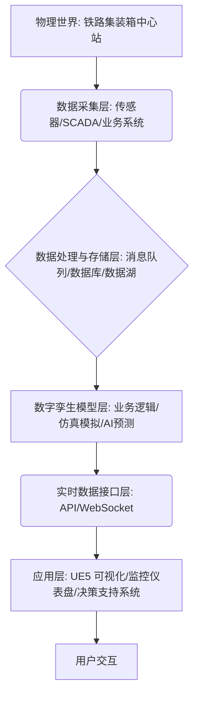
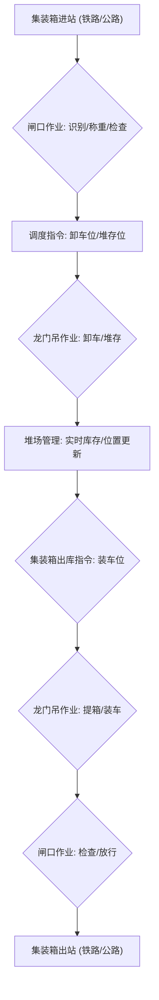

# RailHub-Twin-UE5: 铁路集装箱中心站数字孪生模拟


## 🚀 项目简介

本项目旨在构建一个**铁路集装箱中心站的数字孪生模拟系统**，利用 **Unreal Engine 5 (UE5)** 进行高逼真可视化，并通过**实时数据接口**实现与后端业务逻辑和模拟层的双向交互。该系统能够对铁路集装箱中心站的运营进行实时监控、预测分析和优化，为智慧物流和铁路现代化提供技术支持。

## ✨ 项目亮点

*   **高逼真可视化**: 基于 Unreal Engine 5 强大的渲染能力，精确还原铁路集装箱中心站的物理布局和动态作业场景。
*   **实时数据集成**: 通过 WebSocket 和 RESTful API 实现与后端模拟层和真实业务系统的实时数据交互，确保虚拟世界与物理世界同步。
*   **业务逻辑模拟**: 后端 Python 模拟层实现集装箱进出站、堆场管理、龙门吊作业、集卡调度等核心业务流程的仿真。
*   **可扩展架构**: 采用分层架构设计，易于集成更多传感器数据、AI 预测模型和决策支持功能。
*   **开源与模块化**: 提供清晰的代码结构和详细的文档，方便开发者理解、扩展和二次开发。

## 架构流程图

### 总体系统架构

铁路集装箱中心站数字孪生系统采用分层架构，主要包括物理层、数据采集与处理层、数字孪生模型层和应用层。各层之间通过标准化的接口进行通信，确保系统的可扩展性和灵活性。



**各层职责：**

*   **物理层 (Physical Layer)**: 真实的铁路集装箱中心站，包括轨道、堆场、龙门吊、集卡、集装箱、作业人员等实体及其运行状态。
*   **数据采集层 (Data Acquisition Layer)**: 负责从物理世界获取实时数据，包括但不限于：传感器数据、SCADA/PLC 数据、业务系统数据。
*   **数据处理与存储层 (Data Processing & Storage Layer)**: 对采集到的原始数据进行清洗、转换、聚合，并存储。
*   **数字孪生模型层 (Digital Twin Model Layer)**: 系统的核心，包含中心站的几何模型、物理模型、行为模型和规则模型，进行业务逻辑模拟、仿真模拟和 AI 预测。
*   **实时数据接口层 (Real-time Data Interface Layer)**: 提供标准化的接口，供应用层订阅和发布数据，实现数字孪生模型与可视化应用之间的实时数据同步。
*   **应用层 (Application Layer)**: 面向用户的应用，包括基于 UE5 的三维可视化界面、运营监控仪表盘、决策支持系统等。

### 核心业务流程

铁路集装箱中心站的核心业务流程主要包括集装箱的进站、卸车、堆存、装车、出站等环节。数字孪生系统将对这些流程进行实时映射和模拟。



## 🛠️ 技术栈

*   **后端/模拟层**: Python (FastAPI/Django Channels for WebSocket), C++ (高性能仿真模块), Kafka (消息队列), PostgreSQL/InfluxDB (数据存储)。
*   **前端/可视化层**: Unreal Engine 5 (C++/蓝图)。
*   **数据接口**: WebSocket, RESTful API。

## 💻 代码结构

```
RailHub-Twin-UE5/
├── README.md
├── system_architecture.md          # 系统架构设计文档
├── src/
│   ├── simulator/                  # 模拟层代码
│   │   └── terminal_simulator.py   # 铁路集装箱中心站模拟器示例
│   └── api/                        # API 和 WebSocket 接口层代码
│       └── main.py                 # FastAPI 应用示例
└── docs/
    └── ue5_integration/            # UE5 集成相关文档
        └── ue5_integration_guide.md  # UE5 集成指南
```

## 🚀 快速开始

### 1. 环境准备

*   **Python 环境**: 确保安装 Python 3.8+。
*   **Node.js 环境**: 如果需要运行前端构建工具。
*   **Unreal Engine 5**: 安装 UE5 引擎。

### 2. 后端模拟器与 API 启动

1.  **安装 Python 依赖**：
    ```bash
    pip install fastapi uvicorn websockets
    ```
2.  **启动 API 服务器**：
    ```bash
    cd src/api
    uvicorn main:app --host 0.0.0.0 --port 8000 --reload
    ```
    这将启动一个 FastAPI 服务器，提供 RESTful API 和 WebSocket 接口。
3.  **运行模拟器 (可选，仅用于独立测试模拟逻辑)**：
    ```bash
    cd src/simulator
    python terminal_simulator.py
    ```

### 3. Unreal Engine 5 集成

请参考 `docs/ue5_integration/ue5_integration_guide.md` 文档，了解如何在 UE5 中设置项目、实现 WebSocket 客户端和 RESTful API 调用，以实现实时可视化。

## 🤝 贡献

欢迎对本项目提出建议或贡献代码。如果您有任何问题，请随时提交 Issue。

## 📄 许可证

本项目采用 MIT 许可证。
