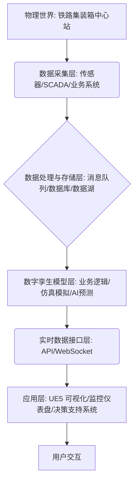

# 铁路集装箱中心站数字孪生项目系统架构设计

## 1. 引言

本项目旨在构建一个铁路集装箱中心站的数字孪生系统，通过集成物理世界数据、模拟仿真和虚幻引擎5 (UE5) 可视化，实现对中心站运营的实时监控、预测分析和优化。本设计文档将详细阐述系统的整体架构、数据流以及实时数据接口规范。

## 2. 总体系统架构

铁路集装箱中心站数字孪生系统采用分层架构，主要包括物理层、数据采集与处理层、数字孪生模型层和应用层。各层之间通过标准化的接口进行通信，确保系统的可扩展性和灵活性。



**各层职责：**

*   **物理层 (Physical Layer)**: 真实的铁路集装箱中心站，包括轨道、堆场、龙门吊、集卡、集装箱、作业人员等实体及其运行状态。
*   **数据采集层 (Data Acquisition Layer)**: 负责从物理世界获取实时数据，包括但不限于：
    *   **传感器数据**: 龙门吊位置、速度、载荷；集卡位置、速度；集装箱识别 (RFID/OCR)；环境数据等。
    *   **SCADA/PLC 数据**: 设备运行状态、故障信息等。
    *   **业务系统数据**: 计划作业指令、集装箱进出站信息、库存信息、调度指令等。
*   **数据处理与存储层 (Data Processing & Storage Layer)**: 对采集到的原始数据进行清洗、转换、聚合，并存储。可能包含实时流处理（如 Kafka）、时序数据库（如 InfluxDB）、关系型数据库（如 PostgreSQL）或数据湖。
*   **数字孪生模型层 (Digital Twin Model Layer)**: 系统的核心，包含中心站的几何模型、物理模型、行为模型和规则模型。在此层进行：
    *   **业务逻辑模拟**: 根据实际业务规则模拟集装箱的流转、堆场管理、作业调度等。
    *   **仿真模拟**: 对未来状态进行预测，例如拥堵预测、资源利用率分析等。
    *   **AI 预测**: 基于历史数据和实时数据进行预测性维护、智能调度优化等。
*   **实时数据接口层 (Real-time Data Interface Layer)**: 提供标准化的接口，供应用层订阅和发布数据，实现数字孪生模型与可视化应用之间的实时数据同步。
*   **应用层 (Application Layer)**: 面向用户的应用，包括基于 UE5 的三维可视化界面、运营监控仪表盘、决策支持系统等，用于展示数字孪生状态、接收用户指令。

## 3. 核心业务流程

铁路集装箱中心站的核心业务流程主要包括集装箱的进站、卸车、堆存、装车、出站等环节。数字孪生系统将对这些流程进行实时映射和模拟。

```mermaid
graph TD
    A[集装箱进站 (铁路/公路)] --> B{闸口作业: 识别/称重/检查};
    B --> C[调度指令: 卸车位/堆存位];
    C --> D{龙门吊作业: 卸车/堆存}; 
    D --> E[堆场管理: 实时库存/位置更新];
    E --> F{集装箱出库指令: 装车位};
    F --> G{龙门吊作业: 提箱/装车};
    G --> H{闸口作业: 检查/放行};
    H --> I[集装箱出站 (铁路/公路)];
```

## 4. 实时数据接口规范

实时数据接口是连接数字孪生模型层与应用层的关键。我们将主要采用 **WebSocket** 和 **RESTful API** 两种方式。

### 4.1 WebSocket 接口 (实时数据推送)

WebSocket 用于实现服务器端向客户端（UE5 模拟器）的实时数据推送，确保模拟器能够及时反映物理世界的最新状态。

**数据类型示例：**

*   **实体位置更新**: 龙门吊、集卡、列车、集装箱的实时坐标 (x, y, z) 和姿态 (rotation)。
*   **实体状态更新**: 龙门吊作业状态 (空闲/装载/卸载)、集卡运行状态 (行驶/停止)、集装箱状态 (空/重/损坏)。
*   **事件通知**: 集装箱进出闸口、作业完成、设备故障、调度指令变更等。

**消息格式 (JSON 示例):**

```json
{
    "type": "entity_update",
    "timestamp": 1678886400,
    "entity_id": "crane_001",
    "entity_type": "crane",
    "data": {
        "position": {"x": 100.5, "y": 50.2, "z": 15.0},
        "rotation": {"pitch": 0.0, "yaw": 90.0, "roll": 0.0},
        "status": "loading",
        "current_container_id": "C0012345"
    }
}
```

```json
{
    "type": "event_notification",
    "timestamp": 1678886405,
    "event_type": "container_entry",
    "data": {
        "container_id": "C0012346",
        "entry_gate": "gate_north",
        "transport_mode": "truck"
    }
}
```

### 4.2 RESTful API 接口 (指令与查询)

RESTful API 用于客户端（UE5 模拟器或外部系统）向数字孪生模型层发送指令（如模拟调度指令）或查询历史数据。

**API 示例：**

*   **GET /containers/{id}**: 查询特定集装箱的详细信息和历史轨迹。
*   **POST /dispatch/crane**: 发送龙门吊调度指令。
    *   **请求体示例：**
        ```json
        {
            "crane_id": "crane_002",
            "action": "move_container",
            "container_id": "C0012347",
            "target_position": {"x": 200.0, "y": 100.0, "z": 0.0}
        }
        ```
*   **GET /yard/layout**: 获取堆场布局和可用堆位信息。

## 5. UE5 集成考量

UE5 将作为数字孪生系统的可视化前端。通过其蓝图系统和 C++ 编程能力，可以实现：

*   **场景构建**: 精确还原铁路集装箱中心站的物理布局。
*   **实体映射**: 将数字孪生模型中的龙门吊、集卡、集装箱等实体映射到 UE5 中的对应资产。
*   **实时数据绑定**: 通过 WebSocket 客户端接收实时数据，更新 UE5 中实体的位置、状态、动画等。
*   **交互功能**: 用户可以在 UE5 中进行视角的切换、信息查询，甚至通过 API 发送模拟指令。

## 6. 技术栈展望

*   **后端/模拟层**: Python (FastAPI/Django Channels for WebSocket), C++ (高性能仿真模块), Kafka (消息队列), PostgreSQL/InfluxDB (数据存储)。
*   **前端/可视化层**: Unreal Engine 5 (C++/蓝图)。
*   **数据接口**: WebSocket, RESTful API。

本设计文档为项目的初步架构，后续将根据具体需求和技术选型进行细化和完善。
